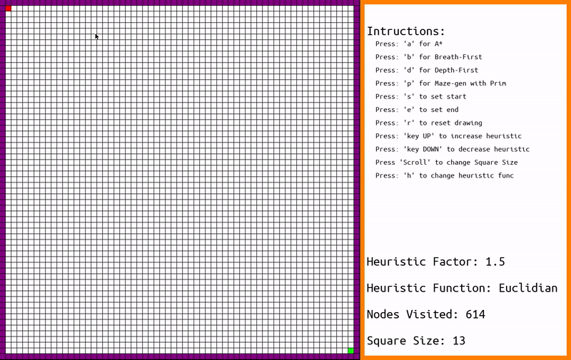
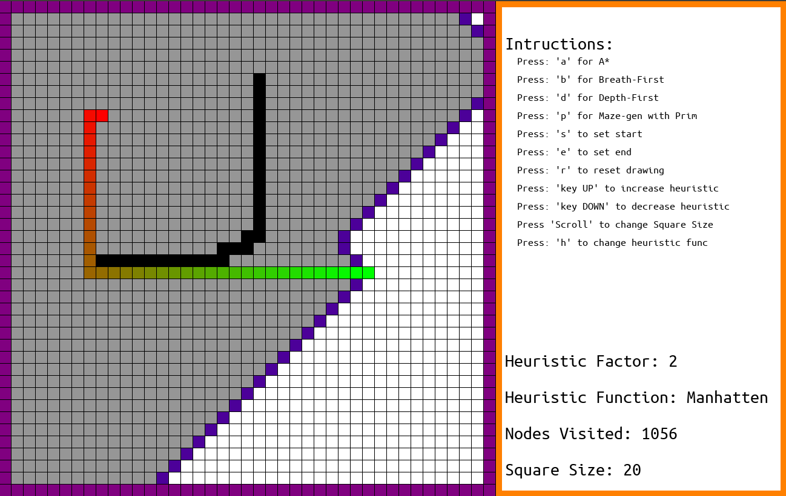
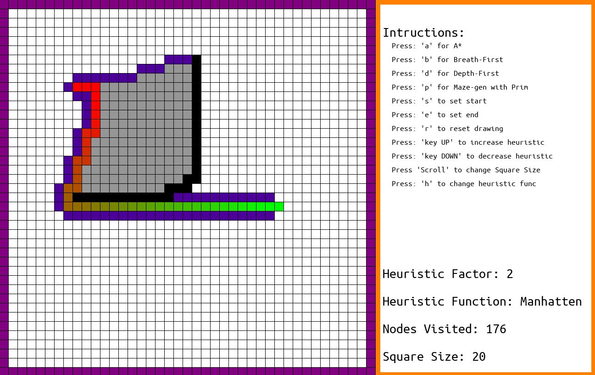
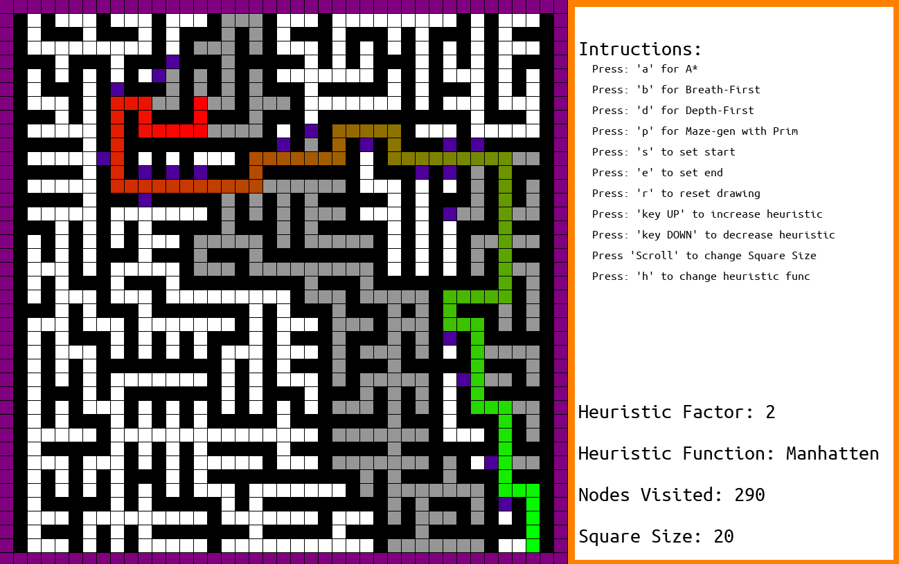
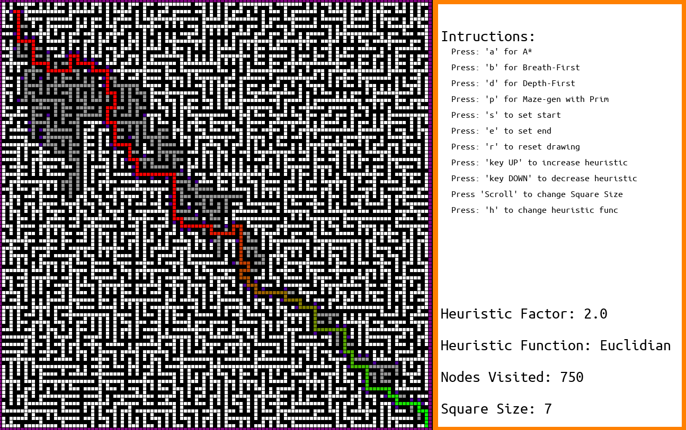

# Path Finding Algorithms

## NOTE
- This repo is not done yet, and is still a work in progress. A lot of the code is very messy and will be fixed in the future.
- The maze generation doesn't always work perfectly on any square size

## About
This repo contains a program for illustrating different path finding algorithms. This includes `breath-first search`, `depth-first search` and `A*`. Also includes the possibility of creating a maze using a randomized version of `prims minimum spanning tree` algorithm.

The implementation is quite messy, and the purpose of this repo is not to create an optimized algorithm, but rather illustrate the difference in the path finding algorithms.

## How to run
To run the program simply execute `python game.py`
This program uses [pygame](https://www.pygame.org/wiki/about), so make sure to `pip install` that first.

## Images

### Demo GIF

### BFS 

### A\* 

### Maze Gen With Prims 

### Rescaling Example

